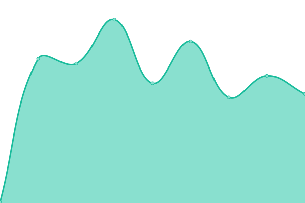
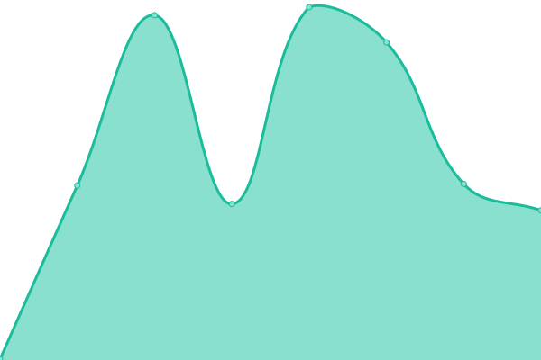

# [📈 Live Status](https://status.ego.pub): <!--live status--> **🟧 Partial outage**

This repository contains the open-source uptime monitor and status page for [ColdSun](https://ego.ninja), powered by [Upptime](https://github.com/upptime/upptime).

With [Upptime](https://upptime.js.org), you can get your own unlimited and free uptime monitor and status page, powered entirely by a GitHub repository. We use [Issues](https://github.com/coldsunera/status/issues) as incident reports, [Actions](https://github.com/coldsunera/status/actions) as uptime monitors, and [Pages](https://status.ego.pub) for the status page.

<!--start: status pages-->
<!-- This summary is generated by Upptime (https://github.com/upptime/upptime) -->
<!-- Do not edit this manually, your changes will be overwritten -->
<!-- prettier-ignore -->
| URL | Status | History | Response Time | Uptime |
| --- | ------ | ------- | ------------- | ------ |
|  [ResetERA](https://www.resetera.com) | 🟩 Up | [reset-era.yml](https://github.com/ColdSunERA/status/commits/HEAD/history/reset-era.yml) | 

 269ms
     
 | 

<a href="https://status.ego.pub/history/reset-era">100.00%</a>
    

|  [EGO Ninja](https://www.ego.ninja) | 🟥 Down | [ego-ninja.yml](https://github.com/ColdSunERA/status/commits/HEAD/history/ego-ninja.yml) | 

 0ms
     
 | 

<a href="https://status.ego.pub/history/ego-ninja">0.00%</a>
    

<!--end: status pages-->

[**Visit our status website →**](https://status.ego.pub)

## 📄 License

- Powered by: [Upptime](https://github.com/upptime/upptime)
- Code: [MIT](./LICENSE) © [ColdSun](https://ego.ninja)
- Data in the `./history` directory: [Open Database License](https://opendatacommons.org/licenses/odbl/1-0/)
